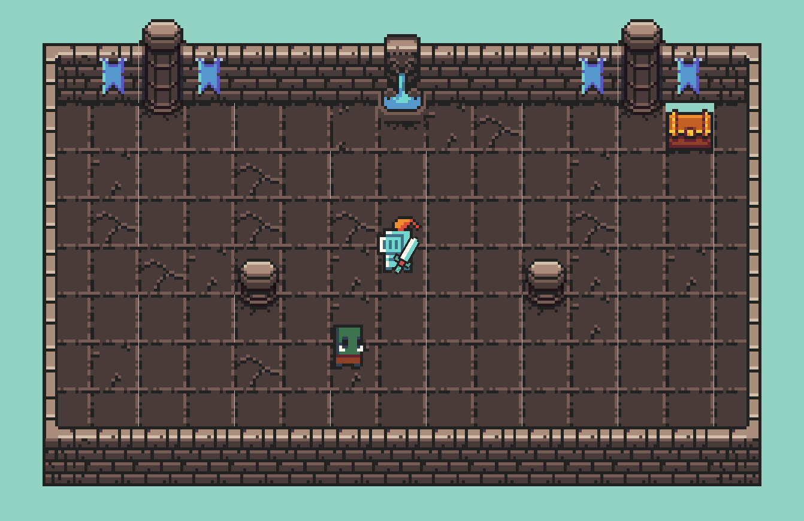

# golang_raylib

A 2D top-down game engine prototype written in Go, targeting a RuneScape 2 / RotMG-style MMO-lite.



Built on [raylib-go](https://github.com/gen2brain/raylib-go) for rendering/audio and [resolv](https://github.com/solarlune/resolv) for collision.

---

## Running

```bash
# Game
go run main.go

# Map editor (WIP)
go run ./dev-tools/map-maker/
```

> Use `go run main.go`, not `go run .` — both `main.go` and `dev-tools/map-maker/main.go` are `package main` so `go run .` errors on the duplicate `main`.

---

## Controls

| Input | Action |
|-------|--------|
| WASD / arrow keys | Move |
| Mouse | Aim |
| Left click | Attack |
| Scroll wheel | Zoom camera |
| `Q` | Toggle music |
| `\` | Toggle debug overlay |
| `1` | Equip keytar (stave) |
| `2` | Equip regular bow |
| `3` | Equip sword-shooter (bow that shoots swords) |
| `4` | Equip bow-shooter (sword that shoots bows) |
| `5` | Equip people-shooter (cannon) |
| `6` | Equip pizza-shooter (stave) |

Default weapon on start: regular sword.

---

## Architecture

```
main.go                         # entry: Initialize → ReadPlayerInputs/Update/Render loop → Quit

game/                           # top-level coordinator
  game-state.go                 # global state, Initialize, Quit, Render
  game-loop.go                  # Update: movement, attack, projectile resolution, map transitions
  input-router.go               # WASD + mouse + weapon switch → player state
  main-player.go                # player construction + weapon equip
  camera.go / window.go         # camera follow, zoom, screen constants

model/                          # pure data structs — no raylib drawing calls
  player.go                     # Player: Move, Attack, EquipWeapon, IsMoving
  enemy.go                      # Enemy: Hurt, Die
  weapon.go                     # Weapon: Move, AnchoredMove
  projectile.go                 # Projectile (Vector2 Start/End, TTL, velocity, trajectory)
  sprite.go                     # Sprite (Src/Dest rects, frame counter, rotation)
  armory/                       # weapon factory functions
    swords/                     # regular sword, bow-shooter, key
    bows/                       # regular bow, sword-shooter
    staves/                     # keytar, pizza-shooter
    cannon/                     # people-shooter
  draw2d/                       # texture load/unload, tile sprite index maps

engines/
  draw-world-engine/            # all rendering: drawPlayer, drawEnemy, drawWeapon,
                                #   drawProjectile, DrawMapBackground, DrawScene, DrawUI
  physics-engine/               # collision, player movement, projectile lifecycle
  audio-engine/                 # sound effects + music streaming
  draw-ui-engine/               # HUD (stub)
  spawn/                        # enemy factory (NewEnemy)

loaders/
  map-loader/                   # parses .map text files → MapModel

directors/
  map-director/                 # orchestrates map load: calls loader, wires draw + collision

shared/                         # plain DTOs shared across layers
  draw/                         # DrawParams (texture, src/dest rect, origin, rotation, tint)
  mapdata/                      # MapModel, TileDimension
  point/                        # Point{X, Y float32}

dev-tools/map-maker/            # WIP tile-placement editor (separate binary)
  gui/                          # raylib GUI panels, asset picker, edit-mode buttons
```

---

## Game loop

```
game.Initialize(debugMode)
  ├─ open window, load texture + audio
  ├─ construct player, equip regular sword
  ├─ load map → build resolv collision space
  └─ spawn orc warrior enemy

for game.Running:
  ReadPlayerInputs()   // WASD, mouse aim, weapon hotkeys, zoom, debug toggle
  Update()             // physics, attack/projectile resolution, audio tick, camera
  Render()             // BeginDrawing → DrawScene (world) → DrawUI (HUD) → EndDrawing
```

---

## Map format

Maps are plain text files under `resources/maps/`:

```
<width> <height>
<tile indices…>      # which tile variant to draw (one int per cell)
<src layer…>         # tile category: f=floor  w=wall  d=decor  n=navigation
<collision layer…>   # collision shape: .=none  +=solid  d=decor  @=full
```

Tile sprite coordinates are defined in `model/draw2d/texture-maps/dungeon-texture.go`.
Walking onto an `n` (navigation) tile triggers a room transition.

---

## Current state

- Single player with mouse-aimed attacks and scroll-wheel zoom
- One enemy type (orc warrior) — hurt flash, death rotation, health bar
- 6 weapon archetypes with configurable projectile count, spread, velocity, TTL, and swing animation
- Two rooms connected by a navigation tile door
- Debug overlay (`\`): FPS, player/mouse coords, aim angle, collision boxes, projectile rays

---

## Dependencies

| Package | Purpose |
|---------|---------|
| `github.com/gen2brain/raylib-go/raylib` | Rendering, input, audio |
| `github.com/solarlune/resolv` | Spatial collision detection |
| `github.com/kvartborg/vector` | Vector math (resolv transitive dep) |

---

## Multiplayer notes

The model layer (`model/`) no longer imports raylib drawing calls, making it suitable for headless server execution. See `MULTIPLAYER_ANALYSIS.md` for the full roadmap.
